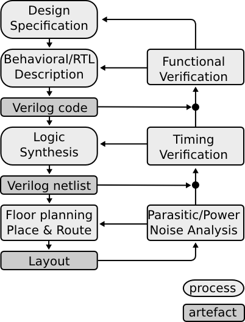
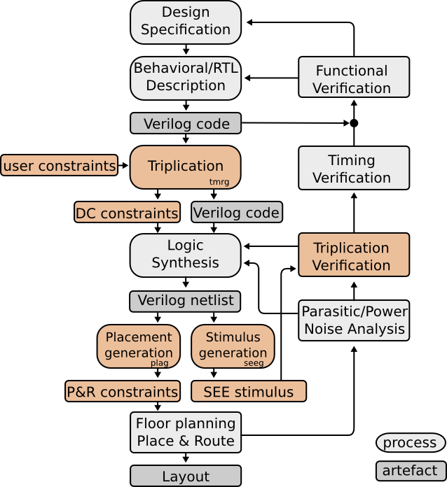

Introduction
############

Single-event effects
====================

Single-event effect is a phenomena triggered by a charged particle passing through an electronic device.
Traversing particle ionizes the matter producing electron-holes pairs. 
The amount of charge being generated depends on particle type, particle energy, incident angle, material.
The charge can by the collected by a drain/source diffusion and can modify its voltage, changing its logical value (from zero to one or vice versa).
Traditionally we distinguish two types of upsets: Single-event Transients (SET) and Single-event Upset (SEU).

Single-event transient is a phenomena in which an error happens in a combinatorial logic. It appears as a short glitch on a net. The proper  value is restored within short time (~ns). 
Importance of SET increases with increasing clock frequency when the duration of SET becomes comparable with a clock period [Buchner]_, [Reed]_.  

Single-event upsets from the other are errors induced in a memory cells (like flip-flop). In contradiction to SET, the value of the memory cell does not recover after SEU [Faccio]_.

Tripple Module Redundancy
=========================

There have been several techniques proposed in order to protect the circuit against events caused by the ionizing particles.
Virtually all techniques relay on a data redundancy. It is assumed, that if the
bit of information is stored in several places (nodes) the information can be properly
reconstructed even if some of these places (nodes) get disturbed.
There are some circuit techniques, based on hardening standard cells ([Whitaker]_, [Velazco]_, [Rockett]_). 
Other techniques address the problem on system level, by utilizing error-correcting coding (ECC), temporal redundancy, or Tripple Module Redundancy.

Tripple Module Redundancy (TMR) concept was originally developed by Von Neumann, with the main purpose of enhancing reliability of electronic circuits. 
This concept was laster on applied in microelectronics for protection against ionizing particles. 
The purpose of TMRG tool is to automatize process of triplicating digital circuits.

Typical design flow
===================

Typical digital flow is shown in a Figure below:

Designer starts with system specification.
As an output of this process a document should be produced which describes 
intended behavior of the system. In the next step a behavioral description is created
in Hardware Description Language (HDL). HDL description is then synthesized to 
a gate level netlist, which than can be used as an input go generate 
fabrication masks. Along the design process, the designer verifies if the created
artifacts fulfill various requirements. 

Design flow for triplicated design
==================================

The TMRG tool-chain interfere with the design flow in several places. The overview of the new flow is shown in Figure below:

As you can see, there are two new steps with respect to the normal flow, and some 
other steps are affected. 

References
==========

.. [Buchner] Buchner, S.; Baze, M.; Brown, D.; McMorrow, D.; Melinger, J., **Comparison of error rates in combinational and sequential logic** Nuclear Science, IEEE Transactions on , vol.44, no.6, pp.2209,2216, Dec 1997

.. [Reed] Reed, R.A.; Carts, M.A.; Marshall, P.W.; Marshall, C.J.; Buchner, S.; La Macchia, M.; Mathes, B.; McMorrow, D., **Single Event Upset cross sections at various data rates** Nuclear Science, IEEE Transactions on , vol.43, no.6, pp.2862,2867, Dec 1996

.. [Faccio] Faccio, F.; Kloukinas, K.; Marchioro, A.; Calin, T.; Cosculluela, J.; Nicolaidis, M.; Velazco, R., **Single event effects in static and dynamic registers in a 0.25 /spl mu/m CMOS technology** Nuclear Science, IEEE Transactions on , vol.46, no.6, pp.1434,1439, Dec. 1999

.. [Whitaker] Whitaker, S.; Canaris, J.; Liu, K., **SEU hardened memory cells for a CCSDS Reed-Solomon encoder** Nuclear Science, IEEE Transactions on , vol.38, no.6, pp.1471,1477, Dec 1991

.. [Velazco] , R.; Calin, T.; Nicolaidis, M.; Moss, S.C.; LaLumondiere, S.D.; Tran, V.T.; Koga, R., **SEU-hardened storage cell validation using a pulsed laser** Nuclear Science, IEEE Transactions on , vol.43, no.6, pp.2843,2848, Dec 1996

.. [Rockett] Rockett, L.R., Jr., **An SEU-hardened CMOS data latch design** Nuclear Science, IEEE Transactions on , vol.35, no.6, pp.1682,1687, Dec 1988
