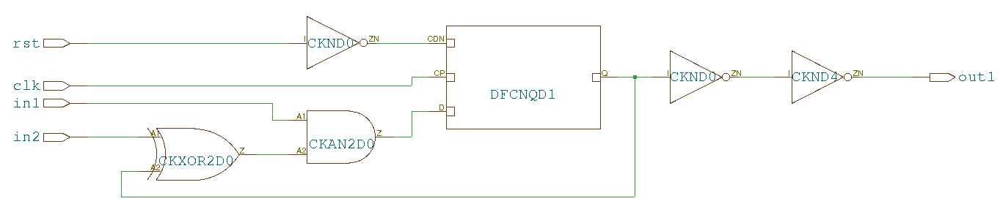
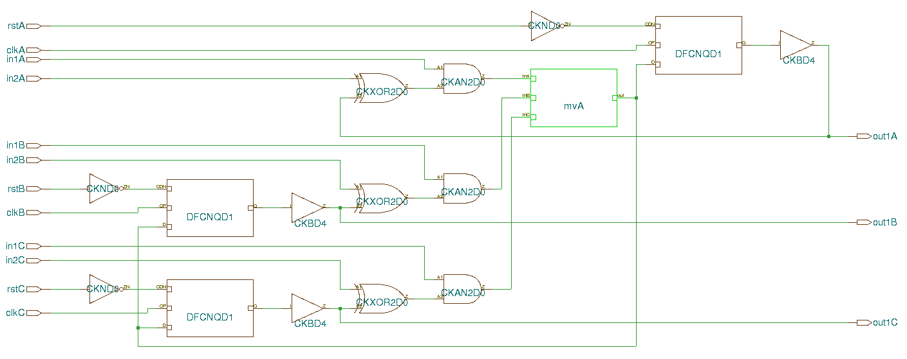
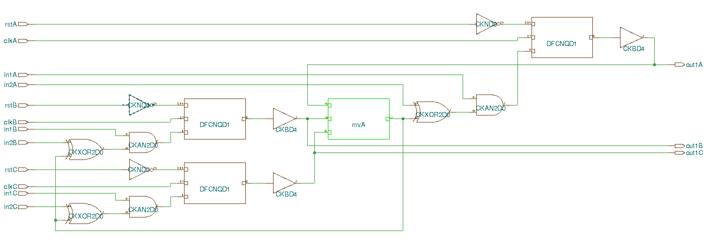
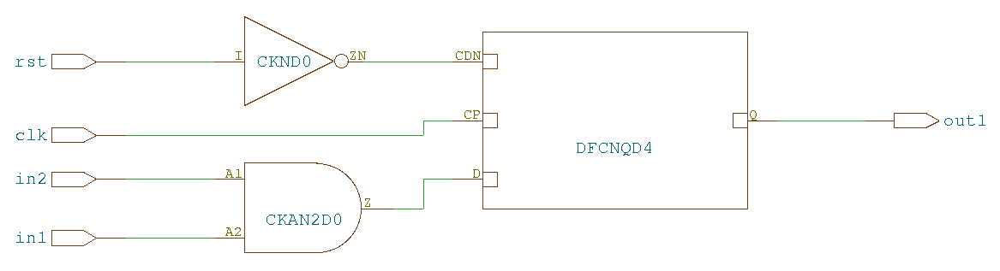
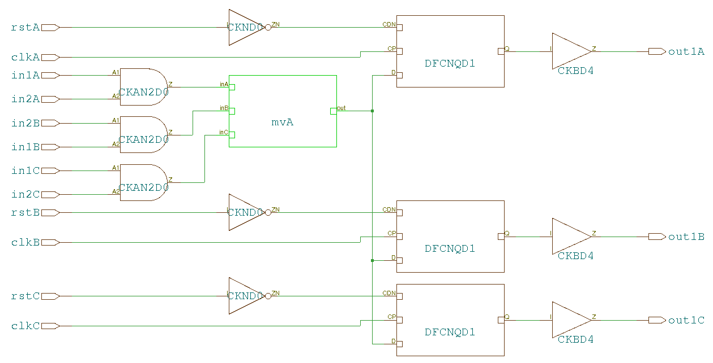
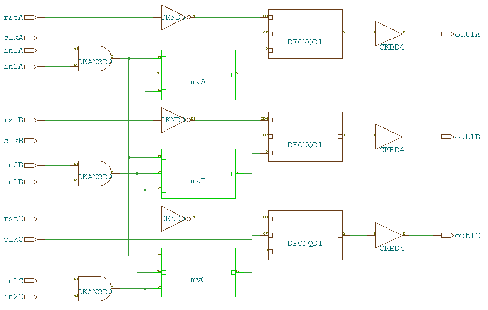

#######
Studies
#######

Tests with synthesis tools
**************************

General remarks
===============

Several simple circuits were designed in order to determine strategy for triplication 
Synthesis was performed with **Cadence Encounter RTL Compiler** (version RC11.21 - v11.20-s012_1, 64-bit).
Unmodified set of scripts from Sandro Bonacini (**THE RECIPE**) was used in order to perform the esynthesis.

.. _sec-fsm-triplication:

Finite State Machine triplication
=================================

Introduction
------------

The implementation of very simple (1 bit) Finite State Machine (FSM) with two inputs
and one output is shown below:

.. literalinclude:: tmr1.v

Output of the synthesis:

Triplication at the flip flop input
-----------------------------------

In the first approach we triplicate all the circuitry (registers, combinatorial logic, and voting logic).
Voting happens at the input of the flip flop. The verilog code representing circuit:

.. literalinclude:: tmr2.v

Output of the synthesis:

As one can see on the image above, the logic and register were triplicated properly. 
The only non-triplicated item is voting logic itself.

Triplication at the flip flop output
------------------------------------

This approach is very similar to the previous one (with voting at the input of the flip flop), however this time
voting happens at the output of the flip flops. The verilog code representing the circuit:

.. literalinclude:: tmr3.v

Output of the synthesis:

As one can see on the image above, the result of synthesis is quite similar as for the previous circuit. 
The logic and register were triplicated properly and voter itself stays  non-triplicated.
Performance wise, the two circuits seem to be equivalent.

Data path triplication
======================

Introduction
------------

In this section, a simple combinatorial logic followed by flip flop was implemented:

.. literalinclude:: tmr11.v

Output of the synthesis:

Triplication at the flip flop input
-----------------------------------

We try to triplicate all the circuitry (registers, combinatorial logic, and voting logic).
Voting happens at the input of the flip flop. The verilog code representing circuit:

.. literalinclude:: tmr12.v

Output of the synthesis:

As one can see on the image above, the logic and register were triplicated properly. 
The only non-triplicated item is voting logic itself.

Using RTL compiler pragmas
==========================

If we ask RTL compier not to optimize output of the voters, like:

.. literalinclude:: tmr13.v

Output of the synthesis:

Conclusions
===========

In general, the triplication in verilog code works fine; primitives like combinatorial logic and flip flops are not optimized out during synthesis.
This behavior is to be expected, as inputs to the combinatorial logic are different (and the tool can not assume anything about them).
Unfortunately, the voting circuit is optimized out in all considered cases, becoming single point of failure. 
Using RTL compiler pragmas one can prevent this optimization. 

