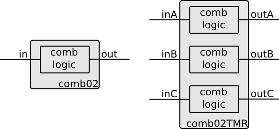
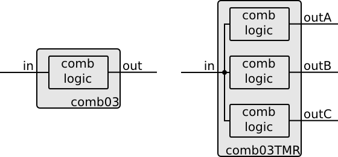
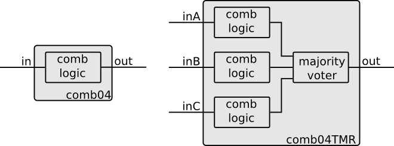
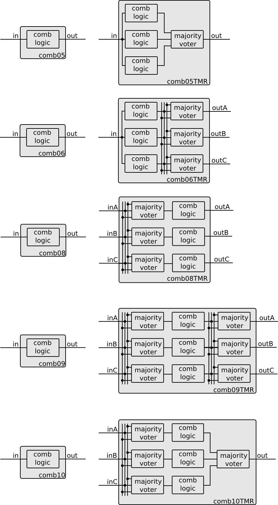
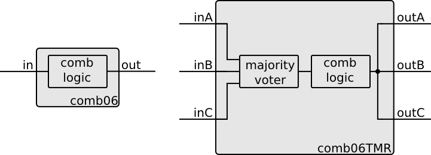
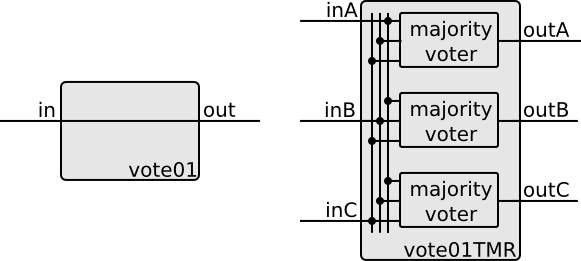
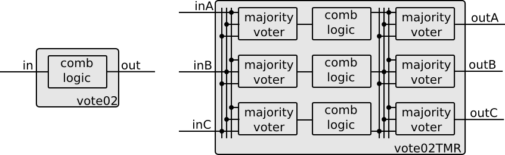
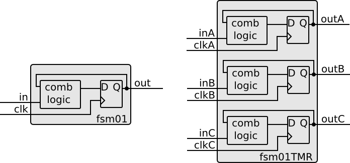
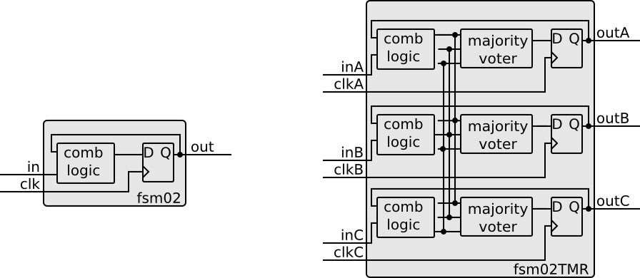
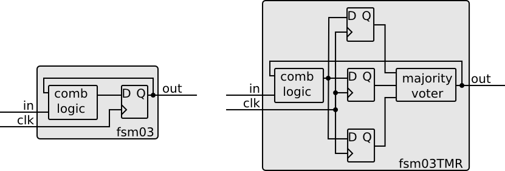

Constrainig the design
**********************

Terminology:
   * SEU - Single Event Upset - change of the value of a memory element (flip-flop)
   * SET - Single Event Transient - temporary (~up to few ns) change of the value of a net 

Triplication
############

Some rules:
  * if non triplicated signal is connected to a triplicated signal a fanout is added
  * if triplicated signal is connected to a non triplicated signal a voter is added

+-----------------------------+----------------------------+----------------------------+
| Signal source / Signal sink | non triplicated            | triplicated                |
+=============================+============================+============================+
| **non triplicated**         | 1 wire connection          | fanout                     |
+-----------------------------+                            +                            +
| **triplicated**             | majority voter             | 3 wires connection         |
+-----------------------------+----------------------------+----------------------------+

Non triplicated module
^^^^^^^^^^^^^^^^^^^^^^

Let us consider simple combinatorial module **comb01**:

.. literalinclude:: ../../examples/comb01.v
   :language: verilog
   :linenos:

comb02 - full triplication
^^^^^^^^^^^^^^^^^^^^^^^^^^

.. literalinclude:: ../../examples/comb02.v
   :language: verilog
   :linenos:

.. literalinclude:: ../../examples/comb02TMR.v
   :language: verilog
   :linenos:

.. include:: ../../examples/comb02.rst

comb03 - logic and output triplication
^^^^^^^^^^^^^^^^^^^^^^^^^^^^^^^^^^^^^^

Chip input signals.
Signals coming from non triplicated analog blocks.

.. literalinclude:: ../../examples/comb03.v
   :language: verilog
   :linenos:

.. literalinclude:: ../../examples/comb03TMR.v
   :language: verilog
   :linenos:

comb04 - input and logic triplication
^^^^^^^^^^^^^^^^^^^^^^^^^^^^^^^^^^^^^

Chip output signals.
Signals going to non triplicated analog blocks.

.. literalinclude:: ../../examples/comb04.v
   :language: verilog
   :linenos:

.. literalinclude:: ../../examples/comb04TMR.v
   :language: verilog
   :linenos:

comb05- logic triplication
^^^^^^^^^^^^^^^^^^^^^^^^^^^^^^^^^^^^^

.. literalinclude:: ../../examples/comb05.v
   :language: verilog
   :linenos:

.. literalinclude:: ../../examples/comb05TMR.v
   :language: verilog
   :linenos:

comb06- input and output triplication
^^^^^^^^^^^^^^^^^^^^^^^^^^^^^^^^^^^^^

.. literalinclude:: ../../examples/comb06.v
   :language: verilog
   :linenos:

.. literalinclude:: ../../examples/comb06TMR.v
   :language: verilog
   :linenos:

Voting
######

Triplication by itself is not enough to ensure SEU robustness, especially when memory elements (flip-flops) are used.
Add more explanation ...

You can see that for TMR modules additional output, tmrError, is added. It goes high whenever there is a mismatch between input signals. 
Several examples how this feature can be used will be shown later.

vote01
^^^^^^^^^^^^^^^^^^^^^^^^^^^^^^^^^^^^^

.. literalinclude:: ../../examples/vote01.v
   :language: verilog
   :linenos:

.. literalinclude:: ../../examples/vote01TMR.v
   :language: verilog
   :linenos:

vote02
^^^^^^^^^^^^^^^^^^^^^^^^^^^^^^^^^^^^^

.. literalinclude:: ../../examples/vote02.v
   :language: verilog
   :linenos:

.. literalinclude:: ../../examples/vote02TMR.v
   :language: verilog
   :linenos:

Finite state machine
####################

Understanding how triplication and voting can be done, lets try to protect a state machine.

fsm01 - triplication without voting
^^^^^^^^^^^^^^^^^^^^^^^^^^^^^^^^^^^^^

Simple case. Everything is triplicated but the errors are not fixed.

.. literalinclude:: ../../examples/fsm01.v
   :language: verilog
   :linenos:

.. literalinclude:: ../../examples/fsm01TMR.v
   :language: verilog
   :linenos:

fsm02 - triplication and voting
^^^^^^^^^^^^^^^^^^^^^^^^^^^^^^^

All elements are protected. 
This type of configuration gives maximum protection.

.. literalinclude:: ../../examples/fsm02.v
   :language: verilog
   :linenos:

.. literalinclude:: ../../examples/fsm02TMR.v
   :language: verilog
   :linenos:

fsm03 - triplicating only register
^^^^^^^^^^^^^^^^^^^^^^^^^^^^^^^^^^

Only memory elements are protected. 
Single event transient appearing in the voting element of combinatorial block close to the clock edge can break the system (all memory cells are corrupted at the same time).

.. literalinclude:: ../../examples/fsm03.v
   :language: verilog
   :linenos:

.. literalinclude:: ../../examples/fsm03TMR.v
   :language: verilog
   :linenos:

Module instantiations
#####################

Accessing individual signals from a triplicated bus
###################################################

Using voting error output
###################################################
