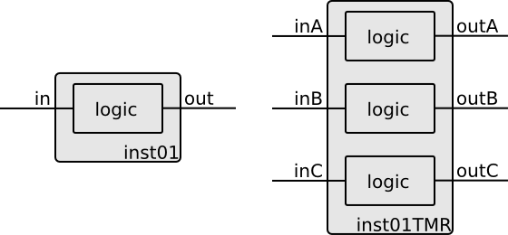
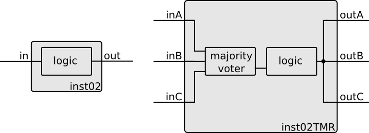
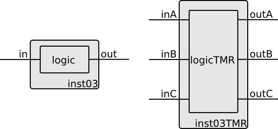

.. _constraining_the_design:

Constraining the design
***********************

.. Terminology:
..   * SEU - Single Event Upset - change of the value of a memory element (flip-flop)
..   * SET - Single Event Transient - temporary (~up to few ns) change of the value of a net 

Triplication
############

To ensure maximum robustness against SEU and SET one should triplicate all
circuitry in the chip. Unfortunately it is not always possible, as the
triplication does come with some penalties. Just to name few one should mention
an increase in occupied area, an increase in power consumption, a reduction in
the maximum clock frequency. Moreover, not all blocks can be easily triplicated,
e.g. I/O ports or some analog blocks.

The TMRG tool lets designer to decide which blocks and signals should be triplicated.
It automatizes also "converting" between triplicated and not triplicated signals.
There are two basic conversion schemes:

  * if non triplicated signal is connected to a triplicated signal a simple passive fanout is added
  * if triplicated signal is connected to a non triplicated signal a majority voter is added

Summary of all possible conversions is summarized in the table below:

+-----------------------------+----------------------------+----------------------------+
| Signal source / Signal sink | non triplicated            | triplicated                |
+=============================+============================+============================+
| **non triplicated**         | 1 wire connection          | fanout                     |
+-----------------------------+                            +                            +
| **triplicated**             | majority voter             | 3 wires connection         |
+-----------------------------+----------------------------+----------------------------+

There are several ways to pass constrains to the TMRG tool, the simplest and the most
intuitive is to put a directives directly in the source code. The directives 
are placed in comments, so they do not affect other tools. The TMRG directive
always starts with **tmrg**  keyword. An example directive may look like:

.. code-block:: verilog
   :linenos:

   // tmrg triplicate netName

For the time being, lets focus only on three directives:

.. code-block:: verilog
   :linenos:

   // tmrg default [triplicate|do_not_triplicate]
   // tmrg triplicate netName
   // tmrg do_not_triplicate netName

The first directive specifies the default behavior for the whole module.
The default behavior can be changed for individual nets using directives from 
line 2 and 3. 

Let us consider simple combinatorial module:

.. literalinclude:: ../../examples/comb01.v
   :language: verilog
   :linenos:

The module models an inverter, which contains only one input, one output. In the
following sections we will see how various directives can affect the same input
code.

comb02 - full triplication
^^^^^^^^^^^^^^^^^^^^^^^^^^

Lets start our examples from appling ``default`` directive

.. literalinclude:: ../../examples/comb02.v
   :language: verilog
   :linenos:

The resulting module will look like:

.. literalinclude:: ../../examples/doc/comb02TMR.v
   :language: verilog
   :linenos:

.. image:: comb02.png
   :align: center

You should note that input, output and logic was triplicated. 

.. include:: ../../examples/comb02.rst

comb03 - logic and output triplication
^^^^^^^^^^^^^^^^^^^^^^^^^^^^^^^^^^^^^^

Imagine that you want to connect ``in`` signal directly to an input pad (or a signal coming from an analog block), in that case you should use directive 
``do_not_triplicate`` as shown below:

.. literalinclude:: ../../examples/comb03.v
   :language: verilog
   :linenos:

.. literalinclude:: ../../examples/doc/comb03TMR.v
   :language: verilog
   :linenos:

.. image:: comb03.png
   :align: center

.. include:: ../../examples/comb03.rst

As you can see, the module connections are  different now. Port ``in`` is not triplicated, while ``out`` is  triplicated. There is also a fanout module added. Moreover, logic itself, modeled by ``wire combLogic`` is also triplicated. 
At this point, one should be aware, that the output module would be the exactly the same if one applies constrains as shown below

.. code-block:: verilog
   :linenos:

   // tmrg default do_not_triplicate
   // tmrg triplicate out combLogic

comb04 - input and logic triplication
^^^^^^^^^^^^^^^^^^^^^^^^^^^^^^^^^^^^^

Lets us consider the opposite situation, where the output is left non triplicated. 

.. literalinclude:: ../../examples/comb04.v
   :language: verilog
   :linenos:

.. literalinclude:: ../../examples/doc/comb04TMR.v
   :language: verilog
   :linenos:

.. image:: comb04.png
   :align: center

.. include:: ../../examples/comb04.rst

As you can see, in order to generate non triplicated output a majority voter is added.

comb05- logic triplication
^^^^^^^^^^^^^^^^^^^^^^^^^^^^^^^^^^^^^

Nothing prevents you, from triplicating only logic.

.. literalinclude:: ../../examples/comb05.v
   :language: verilog
   :linenos:

.. literalinclude:: ../../examples/doc/comb05TMR.v
   :language: verilog
   :linenos:

.. image:: comb05.png
   :align: center

.. include:: ../../examples/comb05.rst

comb06- input and output triplication
^^^^^^^^^^^^^^^^^^^^^^^^^^^^^^^^^^^^^

You can also triplicate everything except logic.

.. literalinclude:: ../../examples/comb06.v
   :language: verilog
   :linenos:

.. literalinclude:: ../../examples/doc/comb06TMR.v
   :language: verilog
   :linenos:

.. image:: comb06.png
   :align: center

.. include:: ../../examples/comb06.rst

majorityVoter and fanout modules
################################

Until now, ``majorityVoter`` and ``fanout`` modules were used without explicitly 
saying what they are. An example implementation of voter can be found in file ``common/voter.v``:

.. literalinclude:: ../../common/voter.v
   :language: verilog
   :linenos:

While an example implementation of fanout can be found in file ``common/fanout.v``:

.. literalinclude:: ../../common/fanout.v
   :language: verilog
   :linenos:

Voting
######

Triplication by itself is not enough to ensure SEU robustness, especially when memory elements (flip-flops) are used.
If an error occurs in one branch it will propagate along the branch. If there is no repair mechanism, after first error the effective cross section is doubled with respect to the non triplicated circuit. In order to eliminate this problem, a majority voting is needed.

.. You can see that for TMR modules additional output, tmrError, is added. It goes high whenever there is a mismatch between input signals. 
.. Several examples how this feature can be used will be shown later.

vote01
^^^^^^^^^^^^^^^^^^^^^^^^^^^^^^^^^^^^^

Majority voters can be added on a triplicated signal by adding a net declaration with a specific name (``Voted`` postfix). 
By assigning a value of a source signal, one ensures that the module can be simulated or synthesized.

.. code-block:: verilog
   :linenos:

   wire netVoted = net;

A simple pass through is shown below: 

.. literalinclude:: ../../examples/vote01.v
   :language: verilog
   :linenos:

.. literalinclude:: ../../examples/doc/vote01TMR.v
   :language: verilog
   :linenos:

.. image:: vote01.png
   :align: center

.. include:: ../../examples/vote01.rst

vote02
^^^^^^^^^^^^^^^^^^^^^^^^^^^^^^^^^^^^^

.. image:: vote02.png
   :align: center

.. literalinclude:: ../../examples/vote02.v
   :language: verilog
   :linenos:

.. literalinclude:: ../../examples/doc/vote02TMR.v
   :language: verilog
   :linenos:

.. include:: ../../examples/vote02.rst

Finite state machine
####################

Understanding how triplication and voting can be done, lets try to protect a state machine.

fsm01 - triplication without voting
^^^^^^^^^^^^^^^^^^^^^^^^^^^^^^^^^^^^^

Simple case. Everything is triplicated but the errors are not fixed.

.. image:: fsm01.png
   :align: center

.. literalinclude:: ../../examples/fsm01.v
   :language: verilog
   :linenos:

.. literalinclude:: ../../examples/doc/fsm01TMR.v
   :language: verilog
   :linenos:

.. include:: ../../examples/fsm01.rst

fsm02 - triplication and voting
^^^^^^^^^^^^^^^^^^^^^^^^^^^^^^^

All elements are protected. 
This type of configuration gives maximum protection.

.. image:: fsm02.png
   :align: center

.. literalinclude:: ../../examples/fsm02.v
   :language: verilog
   :linenos:

.. literalinclude:: ../../examples/doc/fsm02TMR.v
   :language: verilog
   :linenos:

.. include:: ../../examples/fsm02.rst

fsm03 - triplicating only register
^^^^^^^^^^^^^^^^^^^^^^^^^^^^^^^^^^

Only memory elements are protected. 
Single event transient appearing in the voting element of combinatorial block close to the clock edge can break the system (all memory cells are corrupted at the same time).

.. image:: fsm03.png
   :align: center

.. literalinclude:: ../../examples/fsm03.v
   :language: verilog
   :linenos:

.. literalinclude:: ../../examples/doc/fsm03TMR.v
   :language: verilog
   :linenos:

.. include:: ../../examples/fsm03.rst

Module instantiations
#####################

Until now, we were considering only single modules. In real designs we have 
hierarchy of many modules. Lets try to understand how triplication works in that case.

Only named connections are supported!

All modules must be known at the time of triplication. 
In case of elements from library, one has to load the library (which may not
be that ease) or provide a simple file in which definitions of modules and their
inputs/outputs are provided. In that case, one has to add directive 
''tmrg do_not_touch'' in the module body.

For all other modules (not from library and not having ''do_not_touch'' constrain) 
triplication is always done inside the module. It is NOT possible to have three copies
of the module  inside another module. 

Lets go through some examples.

inst01 - triplicating a fixed macrocell
^^^^^^^^^^^^^^^^^^^^^^^^^^^^^^^^^^^^^^^

In this example we have a cell ''mlogic'' (which presumably comes from the library)
and we do not want to touch internal of the cell. That is why a directive 
''do_not_touch'' is added in the module declaration. 

.. literalinclude:: ../../examples/inst01.v
   :language: verilog
   :linenos:

.. literalinclude:: ../../examples/doc/inst01TMR.v
   :language: verilog
   :linenos:

.. include:: ../../examples/inst01.rst

inst02 - non triplicating a fixed macrocell
^^^^^^^^^^^^^^^^^^^^^^^^^^^^^^^^^^^^^^^^^^^

If you do not want to triplicate a cell which has ''do_not_touch'' property, you 
have to apply ''do_not_triplicate'' constrain specifying **INSTANCE** (not module), similarly as it was in case of signals.
Voters and fanouts will be added if necessary. 

.. literalinclude:: ../../examples/inst02.v
   :language: verilog
   :linenos:

.. literalinclude:: ../../examples/doc/inst02TMR.v
   :language: verilog
   :linenos:

.. include:: ../../examples/inst02.rst

inst03 - triplicating user's macrocell
^^^^^^^^^^^^^^^^^^^^^^^^^^^^^^^^^^^^^^

When the module being instantiated is a subject of triplication as well, only connections
are modified and voters and fanouts are added if necessary. An example bellow shows a
situation when two modules (parent and child) are to be fully triplicated.

.. literalinclude:: ../../examples/inst03.v
   :language: verilog
   :linenos:

.. literalinclude:: ../../examples/doc/inst03TMR.v
   :language: verilog
   :linenos:

.. include:: ../../examples/inst03.rst

Accessing individual signals from a triplicated bus
###################################################

In some very spatial cases you may want to access signals after the triplication
individually. Lets consider two examples:

powerOnReset
^^^^^^^^^^^^

Imagine that you are designing a reset circuit. You want to have a Power-on
reset (POR) block and an external reset signal. As you do not want that SET in
POR block resets your chip, you may decide to triplicate the block. From the 
practical reasons, you still want to keep only one external reset pin.

.. literalinclude:: ../../examples/resetBlock01.v
   :language: verilog
   :linenos:

.. literalinclude:: ../../examples/doc/resetBlock01TMR.v
   :language: verilog
   :linenos:

There is not magic until now. If you decided that you would like to able to 
check during normal operation what is the status of the POR output, the straight
forward way of doing that would be:

.. literalinclude:: ../../examples/resetBlock02.v
   :language: verilog
   :linenos:

.. literalinclude:: ../../examples/doc/resetBlock02TMR.v
   :language: verilog
   :linenos:

You may see that 'porStatus'' signal got triplicated 
which is of course what we want.
Lets think if this is what you really want. 
If you connect it to some kind of digital bus, 
most likely you will have some voting on the way, so you will not have an information
about individual signals. In order to solve the problem, you have to "code" some triplication
manually. If you declare a wire with a special name and with a special assignment (like bellow) 
you gain access to the signal after triplication

.. code-block:: verilog
   :linenos:

   wire myWire;
   wire myWireA=myWire;
   wire myWireB=myWire;
   wire myWireC=myWire;

This convention ensures that you can still simulate and synthesize you original design.
TMRG will convert this declarations during elaboration process to the desired ones.
Lets see how we can use this in our resetBlock example.

.. literalinclude:: ../../examples/resetBlock03.v
   :language: verilog
   :linenos:

.. literalinclude:: ../../examples/doc/resetBlock03TMR.v
   :language: verilog
   :linenos:

As you can see, we ended up with triplicated bus (9 signals!). To finish 
the considerations about resetBlock, one may want also to make it more robust
by voting porRst signal.

.. literalinclude:: ../../examples/resetBlock04.v
   :language: verilog
   :linenos:

.. literalinclude:: ../../examples/doc/resetBlock04TMR.v
   :language: verilog
   :linenos:

clockGating
^^^^^^^^^^^

In the previous example it was shown how to fanout a signal in order to access 
sub-signals in a triplicated signal. Now let us consider opposite situation, how
to generate triplicated signal from arbitrary combination of other signals.

To make example easier to understand, lets take real-life problem: we want
to make a clock gating circuit. A simple implementation with only one gating signal 
may look like:

.. literalinclude:: ../../examples/clockGating01.v
   :language: verilog
   :linenos:

.. literalinclude:: ../../examples/doc/clockGating01TMR.v
   :language: verilog
   :linenos:

If we want to be able to gate individual sub-signals in a triplicate clock, 
we have to use similar trick as in the resetBlock.

.. literalinclude:: ../../examples/clockGating02.v
   :language: verilog
   :linenos:

.. literalinclude:: ../../examples/doc/clockGating02TMR.v
   :language: verilog
   :linenos:

Using voting error output
###################################################

Until now, we did not care whether any of the triplicated signals was
different than others (it is whether an single event upset happened or not).
In some cases it may be desirable to have access to that information.
Imagine that you have a part of the circuit which utilizes clock gating, 
in case of SEU during absence of clock, a voting mechanism is not able
to fix the error to restore the proper state in all memory cells. 
One can think about using information from the majority voter cell to re-enable the
clock for short period of time (one clock cycle) until the error is fixed.

To do this with TMRG tool, one has to use a dedicated directive ``tmr_error
true`` as well as instantiate a net with a specific name ``tmrError``. 
An example below illustrates how it can be done:

.. literalinclude:: ../../examples/tmrOut01.v
   :language: verilog
   :linenos:

.. literalinclude:: ../../examples/doc/tmrOut01TMR.v
   :language: verilog
   :linenos:

As one can see, in non triplicated code tmrError wire has to be set to zero. In
that way the non triplicated circuit is not affected and can be simulated. 
The triplicated tmrError
signal is an OR of all signals from the current module and all instances
instantiated in the module.

Another good use of this feature may be to implement a counter of detected 
single-event upsets.

Available constrains 
###################################################

If you do not like an idea of putting constrains in your source code directly, 
you do not have to do it. You may put your constrains in a configuration file
or you can provide them as a command line arguments.

The configuration file uses standard INI file format. It is a simple text file with a basic structure composed of sections, properties, and values.
An example file may look like:

.. code-block:: ini

   [modName]
     default : triplicate
     net : triplicate
     net : do_not_triplicate
     tmr_error : true

There should be one section per module, each property/value pair sets a constrain. To load a configuration file, you have to specify its name
as a command line argument:

.. code-block:: bash

    $ tmrg -c config.cfg [other_options]
    $ tmrg --config config.cfg [other_options]

Applying constrains is also possible via command line arguments. This approach is net very effective for constraining the whole project, but
may be really handy in the initial phase. A possible constrains are shown bellow:

.. code-block:: bash

    $ tmrg -d "default triplicate modName" [other_options]
    $ tmrg -d "triplicate modName.net" [other_options]
    $ tmrg -d "do_not_triplicate modName.net" [other_options]
    $ tmrg -d "tmr_error true modName" [other_options]

As one can see, syntax is quire similar, however module name has to be specified for each constrain.

A brief summary of all constrains, ways of specifying it, and priorities is shown in Table below.

+------------------------------------------------+------------------------------------------------+------------------------------------------------+
| directive in code (lowest priority)            | configuration file (medium priority)           | command line argument (highest priority)       |
+================================================+================================================+================================================+
| .. code-block:: verilog                        | .. code-block:: ini                            | .. code-block:: verilog                        |
|                                                |                                                |                                                |
|     module modName(..);                        |     [modName]                                  |     -                                          |
|      // tmrg default triplicate                |       default : triplicate                     |     -d "default triplicate modName"            |
|      // tmrg triplicate net                    |       net : triplicate                         |     -d "triplicate modName.net"                |
|      // tmrg do_not_triplicate net             |       net : do_not_triplicate                  |     -d "do_not_triplicate modName.net"         |
|      // tmrg tmr_error true                    |       tmr_error : true                         |     -d "tmr_error true modName"                |
|                                                |                                                |                                                |
+------------------------------------------------+------------------------------------------------+------------------------------------------------+

There is one more important feature which should be mentioned at this point. As there are several ways of specifying constrains and one constrain 
can be overwritten by another, there is mechanism which can ensure the designer that all his intentions are interpreted properly.
When you are calling TMRG tool you can ask for a verbose output using ``-v`` option. Lets consider ``comb06`` module from above example. Lets write a configuration files ``comb06.cnf``

.. code-block:: ini

   [comb06]
   default : do_not_triplicate
   in : triplicate
   out : do_not_triplicate
   combLogic : triplicate
   tmr_error : true

When you run TMRG with additional options and constrains as shown below:
 
.. code-block:: bash

    $ tmrg -vv \
           -w "default triplicate comb06" \
           -w "tmr_error false comb06" \
           -w "triplicate comb06.combLogic" \
           -c comb06.cnf \
           comb06.v

You will see the detailed log of what is being done. The part which is interesting
from the point of this chapter is shown below:

.. code-block:: bash

   [..]
   [DEBUG  ] Loading master config file from /home/skulis/work/tmrg/trunk/bin/../etc/tmrg.cfg
   [DEBUG  ] Loading user config file from /home/skulis/.tmrg.cfg
   [DEBUG  ] Loading command line specified config file from comb06.cnf
   [..]
   [INFO   ] Command line constrain 'directive_default' for module 'comb06' (value:True)
   [INFO   ] Command line constrain 'directive_tmr_error' for module 'comb06' (value:False)
   [INFO   ] Command line constrain 'directive_triplicate' for net 'combLogic' in module 'comb06'
   [..]
   [INFO   ] Applying constrains
   [INFO   ] Module comb06
   [INFO   ]  | tmrErrOut : False (configGlobal:False 
                                  -> configModule:True 
                                  -> cmdModule:False)
   [INFO   ]  | net combLogic : True (configGlobalDefault:True 
                                  -> srcModuleDefault:True 
                                  -> configModuleDefault:False 
                                  -> cmdModuleDefault:True 
                                  -> src:False 
                                  -> config:True 
                                  -> cmd:True)
   [INFO   ]  | net in : True (configGlobalDefault:True 
                                  -> srcModuleDefault:True 
                                  -> configModuleDefault:False 
                                  -> cmdModuleDefault:True 
                                  -> config:True)
   [INFO   ]  | net out : False (configGlobalDefault:True 
                                  -> srcModuleDefault:True 
                                  -> configModuleDefault:False 
                                  -> cmdModuleDefault:True 
                                  -> config:False)
   [..]
   [INFO   ] Module:comb06
   [INFO   ] +####################################################+##################+############+
   [INFO   ] | Nets                                               |        range     |    tmr     |
   [INFO   ] +####################################################+##################+############+
   [INFO   ] | combLogic                                          |                  |    True    |
   [INFO   ] | in                                                 |                  |    True    |
   [INFO   ] | out                                                |                  |   False    |
   [INFO   ] +----------------------------------------------------+------------------+------------+
   [..]

You can check in the last table whether the constrains are applied as intended.
If not, you can follow step by step process of applying constrains to understand
at which point something went wrong.

Limitations
############

  * do not use concatenation on left hand side of any assignment
  * do not mix triplicated and non triplicated signals (on the left hand side of any assignment) 
    in blocks
  * only named connections are supported for module instantiation
  * do not use expressions in the module connections

